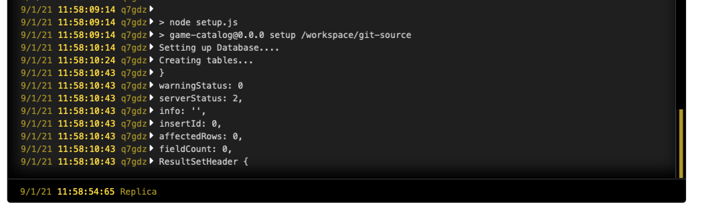

# Building a Game Catalogue API 

APIs are a common way to expose data and information on the internet. 

In this tutorial, we'll build a simple API to provide Create, Read, Update and Delete (CRUD for short) functions for a personal game catalogue. We'll secure it with [HTTP Basic Authentication](link), while allowing easy upgrade to a more secure scheme. 

## Overview and Requirements

You'll need the following services and software setup for this tutorial 

- [Git](https://git-scm.com) setup and installed, and a registered [GitHub account](https://github.com).
- [Node.js](https://nodejs.org/) installed
- A registered [Code Capsules](https://codecapsules.io) account.
- An IDE or text editor to create the project in. This tutorial was made using [Visual Studio Code](https://code.visualstudio.com), but feel free to use any tool you like. 
## Overview and Requirements

You'll need the following services and software setup for this tutorial 

- [Git](https://git-scm.com) setup and installed, and a registered [GitHub account](https://github.com).
- [Node.js](https://nodejs.org/) installed
- A registered [Code Capsules](https://codecapsules.io) account.
- An IDE or text editor to create the project in. This tutorial was made using [Visual Studio Code](https://code.visualstudio.com), but feel free to use any tool you like. 


## Setting Up The Project

With our requirements in place, we can get started on setting them up to work as needed for our web file project.

### Creating a New Repo 

We need a place to store our code from which [Code Capsules](https://codecapsules.io) can deploy to a capsule.

Head over to [GitHub](https://github.com), and create a new repo. We're calling it _game-api_ here, but you can call it whatever you like. You can choose a **Node** `.gitignore` file to get started. Then clone the new Github repo onto your computer and navigate to that directory in terminal (or command prompt, if you're on Windows).

### Initialising the Base Project

We'll use the [Express.js](http://expressjs.com/en/starter/generator.html) generator to create the project base. [Express](http://expressjs.com) is a lightweight web framework for Node.js. To create the base project, type in the following: 

```bash
npx express-generator --no-view
npm install
```

This creates a few files and folders that we can edit. The `--no-view` option tells the generator to use skip adding a HTML view engine. This is because we don't need any views for an API. 

The command `npm install` downloads and installs all the dependencies and packages required by the base project. Open the folder with [Visual Studio Code](https://code.visualstudio.com) or an editor of your choice, and browse through the files to get familiar. The `app.js` file in the project root is the main entry point for the app. 

Great, it's time to push this boilerplate project up to git. We can do it with the following from the command prompt or terminal: 

```bash
git add . 
git commit -am 'added base files for project'
git push origin
```

### Creating a new Backend Capsule 

We'll need a place to host our app. 

1. Log in to [Code Capsules](https://codecapsules.io), and create a Team and Space as necessary.
2. Link [Code Capsules](https://codecapsules.io) to the [GitHub account](https://github.com) repository created above. You can do this by clicking your user name at the top right, and choosing _Edit Profile_. Now you can click the _Github_ button to link to a repo. 
3. Create a new Capsule, selecting the "Backend" capsule type.
4. Select the GitHub repository you create above. If you are only using the repo for this project, you can leave the _Repo Subpath_ field empty. You may need to add your repo to the team repo if you haven't already. Click the _Modify Team Repos_ to do so. 
5. Click _Next_, then on the following page, click _Create Capsule_. 

### Creating a new Data Capsule 

We'll need some data storage to store the files that are uploaded to the web drive. 

1. Create a new Capsule, selecting the "Data Capsule" type. 
1. Select "MySQL." as the Data Type. Choose a product size, and give it a name. 
1. Click "Create Capsule". 
1. You can follow the [in-depth creation guide](https://codecapsules.io/docs/reference/set-up-mysql-data-capsule/) if you'd like more information on creating a data capsule. 


### Link the Capsules

To use the Data Capsule with the Backend Capsule, we need to link them. Head over to the backend capsule you created above, and click on the "Config" tab. Then scroll down to "Bind Data Capsule", and click "Bind" under the name of the data capsule you created. 


After binding the capsules, scrolling up to the section "Capsule Parameters", you'll notice that an environment variable, `DATABASE_URL`, containing the connection string to the MySQL database, is automatically added. We'll use this environment variable in the code to access the MySQL database. 


## Writing the API Code

Now that we have all our systems setup, we can get onto coding part, which is the best part. 

### Creating the database tables

We will need to setup our database with a table to store the list of all our games. We'll create a very simple table with the following columns:

| id | title | system | year |
|----|-------|--------|------|
|    |       |        |      |

We don't have direct access to the data capsule and the MySQL database it is running. We can only access the data capsule from our backend capsule. So, to make a new table, we'll create a setup script which we can direct the backend capsule to run. 

Create a new file called `setup.js` in the root of your project. Now we need to install a package that will allow us connect to MySQL and send commands. We'll use [`mysql2`](https://www.npmjs.com/package/mysql2). Use `npm` from the terminal to install this package:

```bash
npm install mysql2
```

Now we can add the code to create the table. In the new `setup.js` file, add the following code: 

```js
const mysql = require('mysql2');

console.log('Setting up Database....');

const connection = mysql.createConnection(process.env.DATABASE_URL);

console.log('Creating tables...');
connection.execute(`
    create table games
      (
        id int auto_increment,
        title varchar(500) not null,
        platform varchar(500) not null,
        year int not null,
        constraint games_pk
          primary key (id)
      );
    `, 
    function(err, results, fields){
      if (err) {
        console.error(err);
      }
      console.log(results); 
}); 
```
This code imports the `mysql2` driver package. We write a boot message to the console, just so we can see when the code runs in the logs. Then we can create a new connection to the database, using the connection string that was automatically added to the `DATABASE_URL` environment variable when we bound the capsules. Then we can use the `execute` function to send a SQL command to the database. The SQL create a new table with the columns defined above. It has a callback to let us know if the operation was a success or error. In both cases, we write the output to the console, so we'll be able to see what happened when we read the logs. 

Now, we'll need a way for the backend capsule to be able to run this setup script. We can use the `package.json` file to register a new command that `npm` will be able to run. Open the `package.json` file and add in the following line to the `scripts` object:

```js
    "setup": "node setup.js"
``` 

The complete `package.json` file should look like this now: 

```js
{
  "name": "game-api",
  "version": "0.0.0",
  "private": true,
  "scripts": {
    "start": "node ./bin/www",
    "setup": "node setup.js"
  },
  "dependencies": {
    "cookie-parser": "~1.4.4",
    "debug": "~2.6.9",
    "express": "~4.16.1",
    "morgan": "~1.9.1",
    "mysql2": "^2.3.0"
  }
}
```

We'll need to let our backend capsule know to run this script. Navigate to the "Configure" tab on the backend capsule, and scrool down to the "Run Command" section. Change this to:

```bash
npm run setup
```
Click "Update Capsule" to save this new setting. 

Let's commit the above code to the repo, and push it up so that Code Capsules can run it. Commit and push using the following commands on the terminal: 

```bash
git add . 
git commit -am 'added database setup script'
git push origin
```

If you navigate to the "Logs" tab on the backend capsule, you should see the script booting up and the result of the `CREATE TABLE` command. 



Run
```bash
npx express-generator --no-view
npm install
```

Add in a mySQL driver
```bash
npm install mysql2
```


Add file games.js

```js
var express = require('express');
var router = express.Router();


```


create table games
(
	id int auto_increment,
	title varchar(500) not null,
	platform varchar(500) not null,
	constraint games_pk
		primary key (id)
);


Add in passport-http

```bash
npm install passport-http
```


